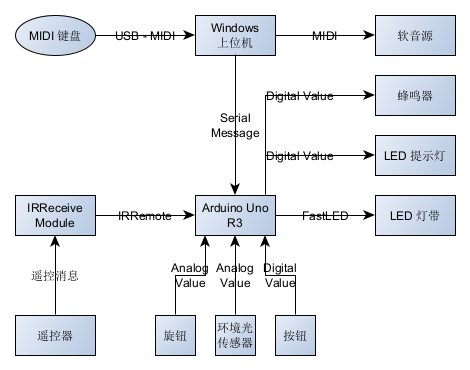

# Effect Piano LED Light Bar Controller - SF

A self-functioning LED light bar controller for Effect Piano based on Arduino Uno R3

**中文** | [English - Working in Process]()

### 特色

- 极低的延迟、极快的响应速度与优良的性能表现；
- 具有完善的保险机制，能够长期连续运行，程序健全性（鲁棒性）高；
- 支持背光、延展功能和 10 个自定义颜色组；
- 支持自定义偏移和按八度偏移，适用于使用 MIDI 键盘移调功能的场景；
- 便利而用户友好的遥控控制逻辑与明确的声光输入响应；
- 支持手动与自动亮度调整逻辑，使用精心调制的亮度曲线；
- 支持通过上位机复制和映射 MIDI 流，适用于使用软音源的实时直播与舞台场景。

### 控制

**遥控器控制**

| 按键       | 功能               | 描述                                                         |
| ---------- | ------------------ | ------------------------------------------------------------ |
| POWER      | 灯带开关           | 轻按以开启或关闭灯带显示。                                   |
| FUNC/STOP  | 延展功能开关       | 轻按以开启或关闭延展功能。                                   |
| VOL+       | 向高音按八度偏移   | 轻按以向高音偏移一个八度。                                   |
| VOL-       | 向低音音按八度偏移 | 轻按以向低音偏移一个八度。                                   |
| RIGHT      | 向高音偏移         | 轻按以向高音偏移半音。                                       |
| LEFT       | 向低音偏移         | 轻按以向低音偏移半音。                                       |
| PLAY/PAUSE | 重置偏移量         | 轻按以恢复音高偏移量为 0。                                   |
| DOWN       | 重置灯光状态       | 轻按以清除当前所有按键亮灯，可用于解决由串口缓冲区溢出引起的错误亮灯状态。 |
| UP         | 切换手动或自动亮度 | 轻按以切换至手动亮度控制或自动亮度控制。                     |
| ST/REPT    | 背光功能开关       | 轻按以开启或关闭背光功能。                                   |
| EQ         | 仅更改前景颜色     | 轻按后，下次按数字键切换颜色组时只改变前景颜色。             |
| 0 ~ 9      | 切换颜色组         | 轻按后，切换至对应序号颜色组。                               |

**其他控制硬件**

| 硬件                | 功能         | 描述                                                         |
| ------------------- | ------------ | ------------------------------------------------------------ |
| 按钮（Push Button） | 重置灯光状态 | 轻按以清除当前所有按键亮灯，可用于解决由串口缓冲区溢出引起的错误亮灯状态。 |
| 旋钮（Knob）        | 手动调节亮度 | 处于手动亮度控制（按遥控器 UP 以切换）时，调节旋钮以调整灯带整体亮度。 |

### 数据流向

### 使用的硬件

- DR-Robot 中级开发套件；
- 适合 MIDI 键盘长度的 WS2812B 可寻址灯带；
- 外部供电（9 ~ 12V）电源或电池盒（可选）；
- 适合 MIDI 键盘长度的 散光板（可选）。

### 软件开发环境

- Visual Studio 2022
- Arduino IDE 1.8.19

### 使用的外部库

- FastLED
- IRRemote
- RtMidi
- SerialPort

### 附加依赖项

- winmm.lib

### 进一步开发计划

- 加入从上位机载入设置与颜色组的功能；
- 加入保存设置与颜色组至上位机的功能；
- 加入灯光滞留功能；
- 寻找廉价替代硬件以降低整体成本。